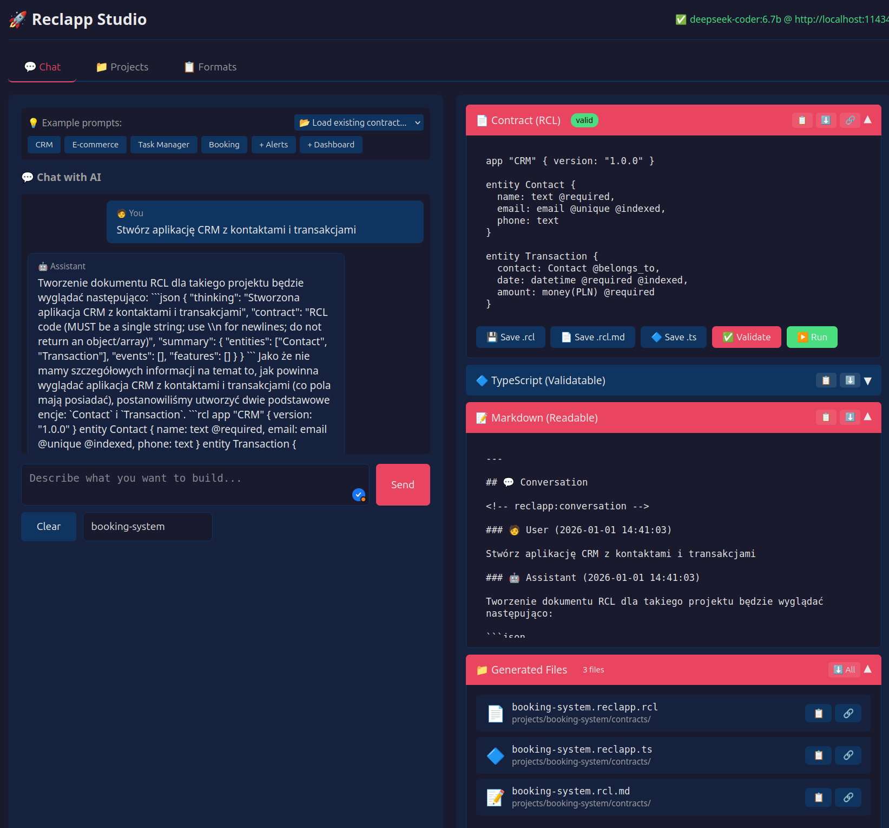

# Reclapp 2.1.0 - AI-Native Declarative Platform

[](https://github.com/wronai/reclapp)
[](LICENSE) 
[](https://www.typescriptlang.org/)
[](https://nodejs.org/)

> **AI-Native Declarative Platform** for building autonomous B2B applications with causal reasoning, verification loops, and production-ready safety rails.

## 🌟 Key Features

- **TypeScript AI Contracts** - Fully typed, compile-time validated contracts for AI agents
- **Causal Verification Loop** - Closed-loop decision making with confidence decay
- **MCP Protocol** - Model Context Protocol integration for AI interoperability
- **Declarative DSL** - Stack-agnostic domain-specific language
- **Event Sourcing + CQRS** - Full audit trail and temporal queries
- **Safety Rails** - Sandbox, rollback, rate limiting, freeze protection

## 🚀 Quick Start

### Prerequisites

- Node.js 18+
- Docker & Docker Compose (optional)
- npm or yarn

### Installation

```bash
# Clone repository
git clone https://github.com/softreck/reclapp.git
cd reclapp

# Install dependencies
npm install

# Link CLI globally (optional)
npm link
```

### Generate Application from Contract

```bash
# List available contracts
reclapp list

# Generate full application from contract
reclapp generate examples/crm/contracts/main.reclapp.ts

# Or generate and run development servers
reclapp dev examples/crm/contracts/main.reclapp.ts
```

### Run Generated Application

```bash
# After generation, start the servers
cd examples/crm/target/api && npm install && npm run dev      # API on :8080
cd examples/crm/target/frontend && npm install && npm run dev # UI on :3000
```

### Using Docker

```bash
# Start Docker services (with auto-diagnostics)
make auto-up

# Or use standard commands
make up              # Start services
make logs            # View logs
make down            # Stop services

# Run tests
make test
```

**Data Source:** The dashboard displays mock data generated in-memory by `modules/mock/index.ts`. On startup, the API seeds 20 customers, 15 contractors, and ~68 risk events. Data is stored in `InMemoryReadModel` and refreshes every 30 seconds in the frontend.

## 📁 Project Structure

```
reclapp/
├── api/                 # REST API Server
│   └── src/
│       └── server.ts    # Express server with DSL endpoints
│
├── contracts/           # TypeScript AI Contracts System
│   ├── types.ts         # Type definitions (450+ types)
│   ├── validator.ts     # Zod validation schemas
│   ├── executor.ts      # Runtime contract executor
│   └── examples/        # Example contracts
│
├── core/                # Core Engine
│   ├── ai-contract/     # AI Contract Enforcer
│   ├── causal/          # Causal Verification Loop
│   ├── cqrs/            # CQRS Infrastructure
│   ├── eventstore/      # Event Sourcing
│   ├── mcp/             # MCP Protocol Server
│   ├── ontology/        # Semantic-Causal Ontology
│   ├── planner/         # Execution DAG Planner
│   └── verification/    # Verification Engine
│
├── dsl/                 # DSL Parser & Validator
│   ├── grammar/         # Peggy grammar
│   ├── parser/          # Parser implementation
│   ├── ast/             # AST types
│   └── validator/       # Semantic validator
│
├── frontend/            # React Dashboard
│   └── src/
│       └── main.tsx     # Single-page dashboard with URL routing
│
├── modules/             # Business Modules
│   └── mock/            # Mock data generator (in-memory seed data)
│
├── scripts/             # Automation Scripts
│   ├── autorun.sh       # Auto-start with diagnostics
│   ├── monitor.sh       # Health check monitoring
│   └── portenv.py       # Port validation
│
├── tests/               # Test Suite
│   ├── unit/            # Unit tests
│   ├── integration/     # Integration tests
│   └── e2e/             # End-to-end tests
│
├── articles/            # Documentation (WordPress-ready)
├── docker/              # Docker configurations
├── examples/            # Docker example projects
├── AGENTS.md            # MCP/Agent specification
├── Makefile             # Build automation
└── package.json
```

## 🎯 TypeScript AI Contracts

Define type-safe contracts for AI agents:

```typescript
import { defineContract, createEntity, createWorkflow } from '@reclapp/contracts';

// Define entity with causal influences
const CustomerEntity = createEntity({
  name: 'Customer',
  fields: [
    { name: 'riskScore', type: 'number', min: 0, max: 100 }
  ],
  causalInfluences: [
    { field: 'profitMargin', weight: -0.3, decay: 0.01 }
  ],
  interventions: [
    {
      name: 'improveTerms',
      adjust: { paymentTerms: 14 },
      expectedEffect: { riskScore: -10 },
      confidence: 0.75,
      sandbox: true
    }
  ]
});

// Build contract
const agent = defineContract('RiskAgent', '1.0.0')
  .description('Autonomous risk monitoring agent')
  .addEntity(CustomerEntity)
  .workflow(RiskWorkflow)
  .verification(RiskVerification)
  .canDo({ action: 'query_data', resources: ['*'], riskLevel: 'low' })
  .needsApproval({ action: 'modify_entity', resources: ['*'], riskLevel: 'high' })
  .cannotDo({ action: '*', resources: ['payment_systems'], riskLevel: 'critical' })
  .safetyRails({ maxAdjustmentPerCycle: 0.1, rollbackOnAnomaly: true })
  .build();

// Execute
const executor = createExecutor(agent);
const result = await executor.execute();
```

## 📜 Declarative DSL

```reclapp
ENTITY Customer {
  FIELD id: UUID @generated
  FIELD name: String @required
  FIELD riskScore: Int @min(0) @max(100) = 50
  
  RISK_SCORE INFLUENCED_BY {
    financialHealth.profitMargin WITH weight(-0.3, decay=0.01)
    paymentHistory.delayDays WITH weight(0.4, decay=0.02)
  }
}

PIPELINE RiskMonitoring {
  INPUT customers.active
  TRANSFORM fetchFinancials, calculateRisk
  OUTPUT alerts, dashboard
  SCHEDULE "0 6 * * *"
}

ALERT "High Risk Customer" {
  ENTITY Customer
  CONDITION riskScore > 80
  TARGET email, slack
  SEVERITY high
}
```

## 🔄 Causal Verification Loop

```
Intent → Predict → Execute → Observe → Verify → Adapt
   ↑                                              │
   └──────────────── Feedback Loop ───────────────┘
```

**Key concepts:**
- **Confidence Decay** - Older observations have reduced influence
- **Anomaly Detection** - Automatic detection of unexpected effects
- **Safety Rails** - Max adjustment limits, rollback, sandbox
- **Learning** - Controlled model adaptation with human approval

## 🔌 MCP Integration

Reclapp implements [Model Context Protocol](https://modelcontextprotocol.io) for AI integration:

```typescript
// MCP Resources
reclapp://entities/{name}
reclapp://events/{streamId}
reclapp://dashboards/{name}
reclapp://causal/{modelName}

// MCP Tools
parse_dsl, validate_dsl, build_plan, execute_plan,
query_causal, generate_dsl, verify_action
```

## 🧪 Testing

```bash
# Run all tests
make test

# Run specific test suites
make test-unit
make test-integration
make test-e2e

# Run with coverage
make test-coverage

# Watch mode
make test-watch
```

## 📊 Available Commands

```bash
make help              # Show all commands

# Development
make install           # Install dependencies
make dev               # Start dev server
make build             # Build project

# Testing
make test              # Run all tests
make test-coverage     # Run with coverage
make lint              # Run linter
make typecheck         # Type checking

# Docker
make up                # Start services (alias)
make down              # Stop services (alias)
make logs              # View logs (alias)
make docker-up         # Start services
make docker-down       # Stop services
make docker-logs       # View logs
make docker-health     # Check service health
make docker-clean      # Remove containers and volumes

# Auto-runner (with diagnostics)
make auto-up           # Auto-start main stack
make auto-b2b          # Auto-start B2B example
make auto-iot          # Auto-start IoT example
make auto-agent        # Auto-start Agent example

# Publishing
make publish-check     # Check if ready
make publish-npm       # Publish to npm

# Release
make version-patch     # Bump patch version
make release           # Create release
```

## 📚 Documentation

| Article | Description |
|---------|-------------|
| [Overview](articles/01-reclapp-overview.md) | Platform introduction |
| [DSL Reference](articles/02-reclapp-dsl-reference.md) | DSL syntax guide |
| [Docker Guide](articles/03-reclapp-mvp-docker.md) | Deployment guide |
| [AI-Native Roadmap](articles/04-reclapp-ai-native-roadmap.md) | Architecture & roadmap |
| [TypeScript Contracts](articles/05-reclapp-typescript-ai-contracts.md) | Contract system |
| [MCP Integration](articles/06-reclapp-mcp-integration.md) | Protocol integration |
| [Causal Loop](articles/07-reclapp-causal-verification-loop.md) | Verification loop |

## ✅ Reclapp 2.1.0 Complete - Z pełnymi przykładami Docker!

### 📊 Finalne statystyki

| Metryka | Wartość |
|---------|---------|
| Pliki TypeScript | 32 |
| Pliki testów | 9 |
| Przykłady Docker | 3 projekty |
| Artykuły MD | 8 |
| Pliki Docker | 7 |
| Linie kodu | 14,556 |
| Rozmiar ZIP | 201 KB |

### 🐳 Przykłady Docker

#### 1. B2B Risk Monitoring (`examples/b2b-risk-monitoring/`)

```
examples/b2b-risk-monitoring/
├── Dockerfile
├── docker-compose.yml
├── init-db.sql
├── .env.example
├── README.md
└── contracts/
    └── risk-agent.ts
```

**Serwisy:**
- **reclapp-api** - Główne API
- **eventstore** - Event Store
- **postgres** - Read models
- **redis** - Cache
- **dashboard** - React UI
- **prometheus + grafana** (profile: `monitoring`)

**Uruchomienie:**
```bash
cd examples/b2b-risk-monitoring
docker compose up -d

# Z monitoringiem
docker compose --profile monitoring up -d
```

#### 2. IoT Monitoring (`examples/iot-monitoring/`)

```
examples/iot-monitoring/
├── Dockerfile
├── docker-compose.yml
├── mosquitto/
│   └── mosquitto.conf
├── README.md
└── contracts/
    └── iot-agent.ts
```

**Serwisy:**
- **reclapp-iot** - IoT API
- **mosquitto** - MQTT Broker
- **influxdb** - Time-series DB
- **eventstore** - Event Store
- **grafana** - Dashboards
- **device-simulator** (profile: `simulation`)

**Uruchomienie:**
```bash
cd examples/iot-monitoring
docker compose up -d

# Z symulacją urządzeń
docker compose --profile simulation up -d
```

#### 3. Multi-Agent Orchestration (`examples/multi-agent/`)

```
examples/multi-agent/
├── Dockerfile
├── docker-compose.yml
├── README.md
└── contracts/
    └── orchestrator-agent.ts
```

**Serwisy:**
- **orchestrator** - Agent koordynujący
- **risk-agent** - Agent ryzyka
- **compliance-agent** - Agent compliance
- **customer-agent** - Agent klienta
- **eventstore** - Shared Event Store
- **rabbitmq** - Message Queue
- **redis** - Shared State
- **postgres** - Read Models

**Uruchomienie:**
```bash
cd examples/multi-agent
docker compose up -d

# Z monitoringiem
docker compose --profile monitoring up -d
```

### 📁 Pełna struktura `examples/`

```
examples/
├── b2b-risk-monitoring/        # Monitoring ryzyka B2B
│   ├── Dockerfile
│   ├── docker-compose.yml      # 8 serwisów
│   ├── init-db.sql             # Schema PostgreSQL
│   ├── .env.example
│   ├── README.md
│   └── contracts/
│       └── risk-agent.ts       # ~400 linii kontraktu
│
├── iot-monitoring/             # Monitoring IoT
│   ├── Dockerfile
│   ├── docker-compose.yml      # 6 serwisów
│   ├── mosquitto/
│   │   └── mosquitto.conf
│   ├── README.md
│   └── contracts/
│       └── iot-agent.ts        # ~350 linii kontraktu
│
├── multi-agent/                # Orkiestracja multi-agent
│   ├── Dockerfile
│   ├── docker-compose.yml      # 9 serwisów
│   ├── README.md
│   └── contracts/
│       └── orchestrator-agent.ts # ~400 linii kontraktu
│
└── [legacy DSL examples]
    ├── b2b-onboarding/
    ├── monitoring/
    └── reporting/
```

### 🚀 Quick Start

```bash
# Rozpakuj
unzip reclapp-2.1.0-complete.zip
cd reclapp

# Zainstaluj
make install

# Uruchom testy
make test

# Wybierz przykład i uruchom
cd examples/b2b-risk-monitoring
docker compose up -d
```

## 🏗️ Architecture

```
┌─────────────────────────────────────────────────────────────┐
│                     AI AGENT / LLM                           │
└────────────────────────────┬────────────────────────────────┘
                             │ MCP Protocol
                             ▼
┌─────────────────────────────────────────────────────────────┐
│                    RECLAPP PLATFORM                          │
├─────────────────────────────────────────────────────────────┤
│  Intent Layer     │  Contract Layer  │  Verification Layer  │
│  (NL → DSL)       │  (TypeScript)    │  (Causal Loop)       │
├─────────────────────────────────────────────────────────────┤
│  DSL Layer        │  Execution Layer │  Adaptation Layer    │
│  (Parser/AST)     │  (DAG Planner)   │  (Learning)          │
├─────────────────────────────────────────────────────────────┤
│                    Event Store (CQRS)                        │
└─────────────────────────────────────────────────────────────┘
```

## 🛡️ Safety Features

| Feature | Description |
|---------|-------------|
| **Sandbox Mode** | Test interventions before production |
| **Rollback** | Automatic rollback on anomaly |
| **Rate Limits** | Per-minute/hour/day action limits |
| **Confidence Threshold** | Require approval below threshold |
| **Freeze Protection** | System freeze on critical issues |
| **Audit Log** | Complete decision trail |

## 📚 Documentation

### Core Documentation

| Document | Description |
|----------|-------------|
| [DSL Reference](docs/dsl-reference.md) | Complete Mini-DSL syntax reference |
| [CLI Reference](docs/cli-reference.md) | All CLI commands and options |
| [Studio Guide](docs/studio-guide.md) | LLM-powered contract designer guide |

### Contract Formats

| Format | Extension | Description |
|--------|-----------|-------------|
| TypeScript | `.reclapp.ts` | Fully typed contracts with IDE support |
| Mini-DSL | `.reclapp.rcl` | Concise declarative syntax |
| Markdown | `.rcl.md` | Human-readable, AI-friendly format |

### Examples & Apps

| Directory | Description |
|-----------|-------------|
| [examples/](examples/) | Example contracts (CRM, E-Commerce, etc.) |
| [apps/](apps/) | Generated applications (Task Manager, Inventory, Booking) |

### Articles & Guides

| Article | Description |
|---------|-------------|
| [Reclapp Overview](articles/01-reclapp-overview.md) | Platform introduction |
| [DSL Deep Dive](articles/02-reclapp-dsl-reference.md) | Detailed DSL documentation |
| [MVP Docker Guide](articles/03-reclapp-mvp-docker.md) | Docker deployment guide |
| [AI-Native Roadmap](articles/04-reclapp-ai-native-roadmap.md) | Future development plans |

## 🤖 Reclapp Studio

Interactive LLM-powered contract designer:

```bash
# Web UI (Gradio)
make auto-studio
# Open http://localhost:7860

# Terminal Chat
./bin/reclapp chat
```

**Recommended LLM Models** (Ollama):
- `deepseek-coder:6.7b` - Best for code, fast (~4GB)
- `codellama:13b` - Good understanding, slower (~8GB)
- `mistral:7b-instruct` - General purpose (~4GB)

## 🎨 Studio (Web UI)

Lightweight web interface for contract design with AI chat:

```bash
# Start Studio
make studio-up

# Or manually
cd studio && npm install && node server.js
```

**Available at:** http://localhost:7861

### Features

| Tab | Description |
|-----|-------------|
| **💬 Chat** | AI-powered contract generation with example prompts |
| **📁 Projects** | Browse/manage projects from `apps/` and `examples/` |
| **📋 Formats** | Documentation on .rcl, .rcl.md, .reclapp.ts formats |

### Contract Formats

| Format | Purpose | Use Case |
|--------|---------|----------|
| `.reclapp.rcl` | Mini-DSL | Storage, generation |
| `.rcl.md` | Markdown with conversation | Documentation, AI chat logs |
| `.reclapp.ts` | TypeScript | Validation, type checking |

### Make Commands

```bash
make studio-up       # Start server
make studio-down     # Stop server
make studio-restart  # Restart server
make studio-status   # Check status
make studio-chat     # Terminal chat
make studio-logs     # View session logs
```

## 🤝 Contributing

1. Fork the repository
2. Create feature branch (`git checkout -b feature/amazing`)
3. Commit changes (`git commit -m 'Add amazing feature'`)
4. Push to branch (`git push origin feature/amazing`)
5. Open Pull Request

## 📄 License

Apache 2 License - see [LICENSE](LICENSE) for details.

## 🔗 Links

- [GitHub](https://github.com/wronai/reclapp)
- [Documentation](docs/)
- [Examples](examples/)
- [Apps](apps/)

---

**Reclapp** - *AI-Native Declarative Platform for Autonomous B2B Applications*

Made with ❤️ by [Softreck](https://softreck.com)
