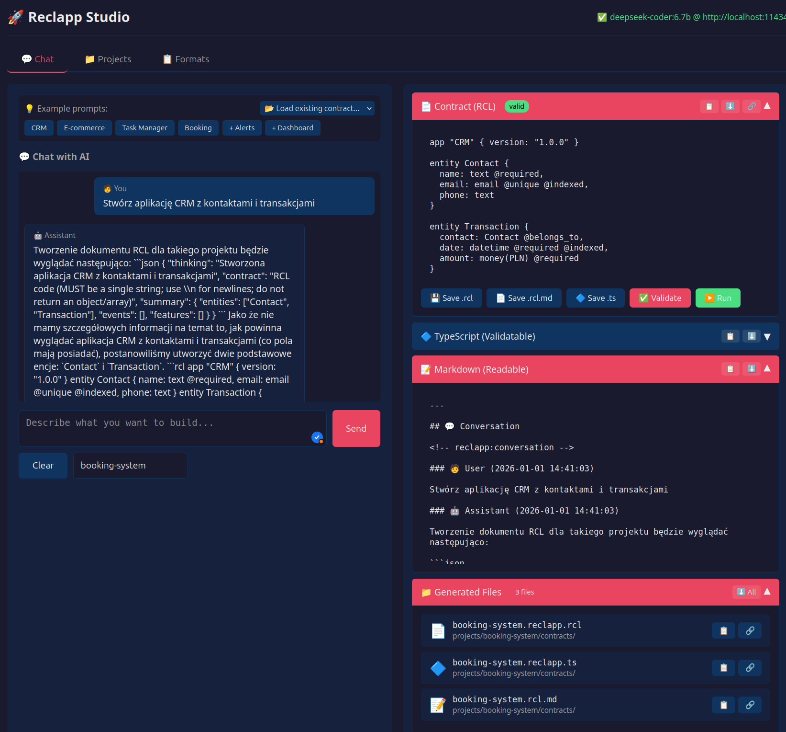

# Reclapp 2.4.1 - AI-Native Declarative Platform

[](https://github.com/wronai/contract)
[](https://opensource.org/licenses/Apache-2.0) 
[](https://python.org/)
[](https://www.typescriptlang.org/)
[](https://github.com/wronai/contract/stargazers)
[](https://github.com/wronai/contract/network/members)
[](https://github.com/wronai/contract/issues)
[](https://github.com/wronai/contract/pulls)
[](https://github.com/wronai/contract/actions)
[](https://github.com/psf/black)
[](http://mypy-lang.org/)
[](https://github.com/wronai/contract)
[](https://github.com/wronai/contract)

> **AI-Native Declarative Platform** for building autonomous B2B applications with causal reasoning, verification loops, and production-ready safety rails.

## 🌟 Key Features

- **Unified Python CLI** - Native implementation of all commands (`evolve`, `analyze`, `refactor`, `tasks`, etc.)
- **Modular Architecture** - Extracted `reclapp-llm` and `reclapp-contracts` for better reusability.
- **Evolution Mode 2.0** - Full lifecycle from prompt to working service with auto-healing and E2E tests.
- **8-Stage Validation** - Syntax, Schema, Assertions, Static Analysis, Tests, Quality, Security, Runtime.
- **Multi-Provider LLM** - Support for OpenRouter (free models), Ollama (local), Windsurf, and LiteLLM.
- **Parallel Task Execution** - Dockerfile-style execution for complex workflows.

## 🚀 Quick Start

### Prerequisites

- Node.js 18+
- Docker & Docker Compose (optional)
- npm or yarn

## 🛠️ Usage

### Evolution Mode (Prompt → Service)

Generate a full application from a natural language description.

```bash
# Generate and run with tests
reclapp evolve -p "Create a todo app with tasks and categories" -o ./my-app

# With auto-healing and keeping the service running
reclapp evolve -p "Build a CRM with contacts and deals" -o ./crm -k
```

### Code Analysis & Refactoring

```bash
# Analyze existing codebase and extract Contract AI
reclapp analyze -d ./src -o contract.ai.json

# Refactor code based on contract changes
reclapp refactor -c contract.ai.json -d ./src --dry-run
```

### Contract Management

```bash
# List available contracts in project
reclapp list -d examples --format table

# Parse Markdown contract to JSON
reclapp parse my-app.rcl.md

# Validate contract structure and business rules
reclapp validate contract.ai.json
```

### Parallel Tasks

```bash
# Run multiple shell commands in parallel from a .tasks file
reclapp tasks build.tasks --workers 4
```

## 🤖 LLM Configuration

Reclapp uses a unified LLM manager with fallback support.

```bash
# Check provider status
reclapp llm status

# List recommended models
reclapp llm models

# Set preferred provider
reclapp llm set-provider openrouter
```

## 📁 Modular Architecture

Reclapp is split into several packages for better maintenance:

1. **\`reclapp\`** (core): Main CLI and orchestrator.
2. **\`reclapp-llm\`**: Unified LLM provider interface (Ollama, OpenRouter, etc.).
3. **\`reclapp-contracts\`**: Contract AI data models and Markdown parser.
4. **\`clickmd\`**: Markdown terminal renderer for consistent output.

## 🏗️ Architecture

\`\`\`
┌─────────────────────────────────────────────────────────────┐
│                    RECLAPP 2.4.1                            │
├─────────────────────────────────────────────────────────────┤
│  INPUT                                                      │
│  ├── Prompt ("Create a CRM system")                         │
│  ├── RCL Markdown (*.rcl.md)                                │
│  └── JSON Contract (contract.ai.json)                       │
├─────────────────────────────────────────────────────────────┤
│  CORE ENGINE (Python Native)                                │
│  ├── Evolution Manager (Auto-healing loop)                  │
│  ├── Task Executor (Parallel processing)                    │
│  └── LLM Manager (Multi-provider routing)                   │
├─────────────────────────────────────────────────────────────┤
│  VALIDATION PIPELINE (8 Stages)                             │
│  ├── 1. Syntax      5. Tests                                │
│  ├── 2. Schema      6. Quality                              │
│  ├── 3. Assertions  7. Security                             │
│  └── 4. Static      8. Runtime                              │
├─────────────────────────────────────────────────────────────┤
│  OUTPUT                                                     │
│  ├── Generated API (Express.js + TypeScript)                │
│  ├── React Frontend (Vite)                                  │
│  └── Infrastructure (Docker, CI/CD)                         │
└─────────────────────────────────────────────────────────────┘
\`\`\`

---

**Reclapp** - *AI-Native Declarative Platform for Autonomous B2B Applications*

## License

Apache License 2.0 - see [LICENSE](LICENSE) for details.

## Author

Created by **Tom Sapletta** - [tom@sapletta.com](mailto:tom@sapletta.com)

Made with ❤️ by [Softreck](https://softreck.com)
