# System Architecture Analysis

## Overview

- **Project**: /home/tom/github/wronai/contract
- **Analysis Mode**: static
- **Total Functions**: 412
- **Total Classes**: 149
- **Modules**: 60
- **Entry Points**: 345

## Architecture by Module

### reclapp.cli
- **Functions**: 50
- **Classes**: 2
- **File**: `cli.py`

### src.python.reclapp.evolution.evolution_manager
- **Functions**: 35
- **Classes**: 3
- **File**: `evolution_manager.py`

### src.python.reclapp.analysis.code_rag
- **Functions**: 32
- **Classes**: 8
- **File**: `code_rag.py`

### src.python.reclapp.evolution.shell_renderer
- **Functions**: 22
- **Classes**: 1
- **File**: `shell_renderer.py`

### reclapp-llm.reclapp_llm.manager
- **Functions**: 21
- **Classes**: 2
- **File**: `manager.py`

### reclapp-contracts.reclapp_contracts.parser.markdown_parser
- **Functions**: 19
- **Classes**: 18
- **File**: `markdown_parser.py`

### src.python.reclapp.cli.main
- **Functions**: 19
- **File**: `main.py`

### src.python.reclapp.sdk.sdk_generator
- **Functions**: 17
- **Classes**: 3
- **File**: `sdk_generator.py`

### src.python.reclapp.generator.code_generator
- **Functions**: 14
- **Classes**: 4
- **File**: `code_generator.py`

### tools.reclapp-setup.setup
- **Functions**: 14
- **Classes**: 12
- **File**: `setup.py`

### src.python.reclapp.analysis.git_analyzer
- **Functions**: 12
- **Classes**: 6
- **File**: `git_analyzer.py`

### src.python.reclapp.evolution.task_queue
- **Functions**: 12
- **Classes**: 2
- **File**: `task_queue.py`

### src.python.reclapp.evolution.state_analyzer
- **Functions**: 11
- **Classes**: 8
- **File**: `state_analyzer.py`

### reclapp-contracts.reclapp_contracts.validation.stages
- **Functions**: 10
- **File**: `stages.py`

### src.python.reclapp.evolution.generators
- **Functions**: 10
- **Classes**: 1
- **File**: `generators.py`

### reclapp-llm.reclapp_llm.ollama
- **Functions**: 9
- **Classes**: 2
- **File**: `ollama.py`

### reclapp-llm.reclapp_llm.windsurf
- **Functions**: 9
- **Classes**: 2
- **File**: `windsurf.py`

### src.python.reclapp.generator.contract_generator
- **Functions**: 8
- **Classes**: 4
- **File**: `contract_generator.py`

### src.python.reclapp.cli.runner
- **Functions**: 8
- **Classes**: 2
- **File**: `runner.py`

### reclapp-llm.reclapp_llm.openrouter
- **Functions**: 7
- **Classes**: 2
- **File**: `openrouter.py`

## Key Entry Points

Main execution flows into the system:

### src.python.reclapp.generator.code_generator.CodeGenerator.generate
> Generate application code from contract.

Args:
    contract: ContractAI specification
    output_dir: Output directory (overrides options)
    
Retur
- **Calls**: time.time, self._log.action, contract.get, contract.get, definition.get, definition.get, definition.get, generation.get

### reclapp.cli.llm_status
> Show LLM providers status and configuration.
- **Calls**: llm.command, sys.path.insert, str, LLMConfig, config.get_default_provider, click.md, list_available_providers, config.list_configured_providers

### src.python.reclapp.evolution.evolution_manager.EvolutionManager._phase_service
> Phase 4: Install deps and start service
- **Calls**: self.task_queue.start, self._find_npm, self.task_queue.start, self.task_queue.start, Path, None.exists, self.task_queue.skip, self.task_queue.skip

### src.python.reclapp.evolution.evolution_manager.EvolutionManager.evolve
> Run the full evolution pipeline with auto-healing.
- **Calls**: time.time, self.renderer.heading, self.renderer.info, self.renderer.info, self.renderer.info, self._setup_tasks, int, EvolutionResult

### src.python.reclapp.analysis.git_analyzer.GitAnalyzer.detect_stack
> Detect technology stack from repository files
- **Calls**: DetectedStack, self._run_git, files_output.split, any, pkg_path.exists, req_path.exists, pyproject_path.exists, any

### src.python.reclapp.evolution.evolution_manager.EvolutionManager._run_e2e_tests
> Run E2E tests and return (passed, failed, output)
- **Calls**: shutil.which, test_file.exists, self.renderer.warning, Path, api_dir.exists, None.exists, Path, asyncio.create_subprocess_exec

### src.python.reclapp.cli.runner.CLIRunner.run
> Run all tasks
- **Calls**: time.time, self.header, self.yaml, self.print_todo, self.task_queue.start, self.renderer.info, time.time, time.time

### reclapp.cli.evolve
> Evolution mode - dynamic code generation with auto-healing
- **Calls**: main.command, click.option, click.option, click.option, click.option, click.option, click.option, click.option

### src.python.reclapp.evolution.evolution_manager.EvolutionManager._with_llm_heartbeat
> Wrap an async LLM call with heartbeat logging.

Emits periodic logs like TS: '… waiting for LLM elapsed=Xs'
- **Calls**: time.time, asyncio.Event, asyncio.create_task, self.renderer.codeblock, heartbeat, int, heartbeat_stop.set, heartbeat_task.cancel

### src.python.reclapp.generator.contract_generator.ContractGenerator._validate_contract
> Validate contract structure
- **Calls**: errors.append, errors.append, errors.append, ContractValidationError, errors.append, errors.append, ContractValidationError, ContractValidationError

### src.python.reclapp.analysis.code_rag.SemanticChunker._parse_python
> Parse Python file for functions and classes
- **Calls**: content.split, enumerate, re.compile, re.compile, re.compile, re.compile, line.strip, patterns.items

### src.python.reclapp.generator.code_generator.CodeGenerator._parse_llm_response
> Parse LLM response to extract generated files
- **Calls**: set, re.finditer, re.finditer, match.groups, path.strip, match.groups, None.strip, enumerate

### reclapp.cli.generate
> Generate code from a contract file
- **Calls**: main.command, click.argument, click.option, click.option, click.option, reclapp.cli._get_core_main, Args, sys.exit

### reclapp.cli.llm_models
> List recommended models for each provider.
- **Calls**: llm.command, click.option, sys.path.insert, str, click.md, click.md, click.Choice, RECOMMENDED_MODELS.keys

### reclapp.cli.llm_priority_set_provider
> Set priority for all models belonging to a provider in litellm_config.yaml.

Provider is inferred from litellm_params.model prefix, e.g. ollama/<...>,
- **Calls**: llm_priority.command, click.argument, click.argument, click.option, click.option, reclapp.cli._load_litellm_yaml, data.get, reclapp.cli._save_litellm_yaml

### src.python.reclapp.cli.executor.TaskExecutor.run_task
> Execute a single task using subprocess
- **Calls**: time.time, self.running.add, self.renderer.info, time.time, self.running.remove, int, self.renderer.info, asyncio.create_subprocess_shell

### src.python.reclapp.generator.contract_generator.ContractGenerator.generate
> Generate a ContractAI from natural language prompt.

Args:
    user_prompt: Natural language description of the application
    
Returns:
    Contract
- **Calls**: time.time, int, ContractGenerationResult, self._log.attempt, self._estimate_tokens, self._parse_contract_from_response, self._validate_contract, self._build_initial_prompt

### tools.reclapp-setup.setup.CLIRunner.run
- **Calls**: time.time, self.console.print, self.print_todo, self.yaml, self.log, self.log, time.time, skip_fn

### reclapp.cli.llm_model_remove_provider
> Remove all model_list entries belonging to a provider (and remove from fallbacks).
- **Calls**: llm_model.command, click.argument, reclapp.cli._load_litellm_yaml, data.get, router_settings.get, isinstance, reclapp.cli._save_litellm_yaml, click.md

### src.python.reclapp.generator.code_generator.CodeGenerator._generate_with_llm
> Generate code using LLM
- **Calls**: time.time, self._build_llm_prompt, self._parse_llm_response, CodeGenerationResult, None.generate, CodeGenerationResult, CodeGenerationResult, self._write_files

### src.python.reclapp.analysis.code_rag.HierarchicalRetriever.get_hierarchy
> Get hierarchical view of codebase
- **Calls**: self.indexer.get_index, index.file_index.items, dir_map.items, levels.append, levels.append, levels.append, str, None.extend

### src.python.reclapp.sdk.sdk_generator.SDKGenerator._generate_client
> Generate API client
- **Calls**: lines.append, lines.append, lines.append, lines.append, lines.append, lines.append, lines.append, lines.append

### src.python.reclapp.evolution.evolution_manager.EvolutionManager._setup_tasks
> Setup full task queue (21 tasks like TypeScript)
- **Calls**: self.task_queue.add, self.task_queue.add, self.task_queue.add, self.task_queue.add, self.task_queue.add, self.task_queue.add, self.task_queue.add, self.task_queue.add

### reclapp.cli.llm_test
> Test LLM generation with a simple prompt.
- **Calls**: llm.command, click.option, click.option, sys.path.insert, str, LLMConfig, click.md, click.md

### src.python.reclapp.evolution.generators.EvolutionGenerators.generate_frontend
> Generate React frontend
- **Calls**: None.get, None.get, src_dir.mkdir, None.write_text, None.write_text, None.write_text, None.write_text, entity_name.lower

### src.python.reclapp.evolution.evolution_manager.EvolutionManager._generate_frontend
> Generate React frontend
- **Calls**: None.get, None.get, src_dir.mkdir, None.write_text, None.write_text, None.write_text, None.write_text, entity_name.lower

### reclapp.cli.llm_model_add
> Add a new model entry to litellm_config.yaml.
- **Calls**: llm_model.command, click.option, click.option, click.option, click.option, click.option, click.option, reclapp.cli._load_litellm_yaml

### reclapp-contracts.reclapp_contracts.validation.pipeline.ValidationPipeline.validate
> Run the validation pipeline.

Args:
    contract: Contract definition
    code: Generated code
    
Returns:
    Pipeline result with all stage result
- **Calls**: time.time, ValidationContext, int, sum, sum, all, PipelineResult, reclapp.cli._Console.print

### src.python.reclapp.evolution.evolution_manager.EvolutionManager._phase_verification
> Phase 10: Final verification with multi-level state analysis
- **Calls**: self.task_queue.start, self.task_queue.done, self.task_queue.start, StateAnalyzer, analyzer.write_state_snapshot, self.task_queue.done, self.task_queue.start, state.is_consistent

### reclapp.cli.reverse
> Reverse-engineer a contract from an existing application
- **Calls**: main.command, click.argument, click.option, click.option, click.md, reclapp.cli.find_node, NODE_CLI.exists, click.md

## Process Flows

Key execution flows identified:

### Flow 1: generate
```
generate [src.python.reclapp.generator.code_generator.CodeGenerator]
```

### Flow 2: llm_status
```
llm_status [reclapp.cli]
```

### Flow 3: _phase_service
```
_phase_service [src.python.reclapp.evolution.evolution_manager.EvolutionManager]
```

### Flow 4: evolve
```
evolve [src.python.reclapp.evolution.evolution_manager.EvolutionManager]
```

### Flow 5: detect_stack
```
detect_stack [src.python.reclapp.analysis.git_analyzer.GitAnalyzer]
```

### Flow 6: _run_e2e_tests
```
_run_e2e_tests [src.python.reclapp.evolution.evolution_manager.EvolutionManager]
```

### Flow 7: run
```
run [src.python.reclapp.cli.runner.CLIRunner]
```

### Flow 8: _with_llm_heartbeat
```
_with_llm_heartbeat [src.python.reclapp.evolution.evolution_manager.EvolutionManager]
```

### Flow 9: _validate_contract
```
_validate_contract [src.python.reclapp.generator.contract_generator.ContractGenerator]
```

### Flow 10: _parse_python
```
_parse_python [src.python.reclapp.analysis.code_rag.SemanticChunker]
```

## Key Classes

### src.python.reclapp.evolution.evolution_manager.EvolutionManager
> Evolution manager with auto-healing code generation.

Full pipeline (21 tasks like TypeScript):
1. C
- **Methods**: 35
- **Key Methods**: src.python.reclapp.evolution.evolution_manager.EvolutionManager.__init__, src.python.reclapp.evolution.evolution_manager.EvolutionManager.set_llm_client, src.python.reclapp.evolution.evolution_manager.EvolutionManager.evolve, src.python.reclapp.evolution.evolution_manager.EvolutionManager._setup_tasks, src.python.reclapp.evolution.evolution_manager.EvolutionManager._phase_setup, src.python.reclapp.evolution.evolution_manager.EvolutionManager._phase_contract, src.python.reclapp.evolution.evolution_manager.EvolutionManager._phase_code_generation, src.python.reclapp.evolution.evolution_manager.EvolutionManager._phase_service, src.python.reclapp.evolution.evolution_manager.EvolutionManager._phase_tests, src.python.reclapp.evolution.evolution_manager.EvolutionManager._phase_additional

### reclapp-llm.reclapp_llm.manager.LLMManager
> LLM Manager with multi-provider support.

Manages multiple LLM providers and provides fallback logic
- **Methods**: 23
- **Key Methods**: reclapp-llm.reclapp_llm.manager.LLMManager.__init__, reclapp-llm.reclapp_llm.manager.LLMManager.is_available, reclapp-llm.reclapp_llm.manager.LLMManager.is_ready, reclapp-llm.reclapp_llm.manager.LLMManager.get_provider, reclapp-llm.reclapp_llm.manager.LLMManager.primary_provider, reclapp-llm.reclapp_llm.manager.LLMManager.providers, reclapp-llm.reclapp_llm.manager.LLMManager.initialize, reclapp-llm.reclapp_llm.manager.LLMManager._load_env_file, reclapp-llm.reclapp_llm.manager.LLMManager._init_ollama, reclapp-llm.reclapp_llm.manager.LLMManager._init_openrouter

### src.python.reclapp.evolution.shell_renderer.ShellRenderer
> Renders colorized output in terminal.

Uses clickmd.MarkdownRenderer when available for consistent r
- **Methods**: 23
- **Key Methods**: src.python.reclapp.evolution.shell_renderer.ShellRenderer.__init__, src.python.reclapp.evolution.shell_renderer.ShellRenderer.renderer, src.python.reclapp.evolution.shell_renderer.ShellRenderer.enable_log, src.python.reclapp.evolution.shell_renderer.ShellRenderer.get_log, src.python.reclapp.evolution.shell_renderer.ShellRenderer.clear_log, src.python.reclapp.evolution.shell_renderer.ShellRenderer.save_log, src.python.reclapp.evolution.shell_renderer.ShellRenderer._log, src.python.reclapp.evolution.shell_renderer.ShellRenderer._get_clickmd, src.python.reclapp.evolution.shell_renderer.ShellRenderer._try_md, src.python.reclapp.evolution.shell_renderer.ShellRenderer._try_echo

### src.python.reclapp.sdk.sdk_generator.SDKGenerator
> Generate TypeScript SDK from ContractAI specification.

Generates:
- types.ts: TypeScript interfaces
- **Methods**: 17
- **Key Methods**: src.python.reclapp.sdk.sdk_generator.SDKGenerator.__init__, src.python.reclapp.sdk.sdk_generator.SDKGenerator.generate, src.python.reclapp.sdk.sdk_generator.SDKGenerator._generate_types, src.python.reclapp.sdk.sdk_generator.SDKGenerator._generate_entity_type, src.python.reclapp.sdk.sdk_generator.SDKGenerator._generate_input_types, src.python.reclapp.sdk.sdk_generator.SDKGenerator._generate_api_response_types, src.python.reclapp.sdk.sdk_generator.SDKGenerator._generate_zod_schemas, src.python.reclapp.sdk.sdk_generator.SDKGenerator._generate_entity_schema, src.python.reclapp.sdk.sdk_generator.SDKGenerator._generate_client, src.python.reclapp.sdk.sdk_generator.SDKGenerator._generate_entity_client_methods

### src.python.reclapp.generator.code_generator.CodeGenerator
> Code generator using LLM.

Generates application code from ContractAI specification.

Example:
    g
- **Methods**: 14
- **Key Methods**: src.python.reclapp.generator.code_generator.CodeGenerator.__init__, src.python.reclapp.generator.code_generator.CodeGenerator.generate, src.python.reclapp.generator.code_generator.CodeGenerator._generate_package_json, src.python.reclapp.generator.code_generator.CodeGenerator._generate_index_file, src.python.reclapp.generator.code_generator.CodeGenerator._generate_entity_model, src.python.reclapp.generator.code_generator.CodeGenerator._generate_route_file, src.python.reclapp.generator.code_generator.CodeGenerator._generate_tsconfig, src.python.reclapp.generator.code_generator.CodeGenerator._map_field_type, src.python.reclapp.generator.code_generator.CodeGenerator._write_files, src.python.reclapp.generator.code_generator.CodeGenerator._estimate_tokens
- **Inherits**: <ast.Subscript object at 0x77f43b781d50>

### src.python.reclapp.evolution.task_queue.TaskQueue
> Task queue with status tracking and YAML output.

Example:
    queue = TaskQueue(verbose=True)
    t
- **Methods**: 13
- **Key Methods**: src.python.reclapp.evolution.task_queue.TaskQueue.__init__, src.python.reclapp.evolution.task_queue.TaskQueue.renderer, src.python.reclapp.evolution.task_queue.TaskQueue.add, src.python.reclapp.evolution.task_queue.TaskQueue.start, src.python.reclapp.evolution.task_queue.TaskQueue.done, src.python.reclapp.evolution.task_queue.TaskQueue.fail, src.python.reclapp.evolution.task_queue.TaskQueue.skip, src.python.reclapp.evolution.task_queue.TaskQueue.get_task, src.python.reclapp.evolution.task_queue.TaskQueue.get_stats, src.python.reclapp.evolution.task_queue.TaskQueue.print

### src.python.reclapp.analysis.git_analyzer.GitAnalyzer
> Analyzes Git repositories for state, tech stack detection, and contract generation.

Example:
    an
- **Methods**: 12
- **Key Methods**: src.python.reclapp.analysis.git_analyzer.GitAnalyzer.__init__, src.python.reclapp.analysis.git_analyzer.GitAnalyzer._run_git, src.python.reclapp.analysis.git_analyzer.GitAnalyzer.is_git_repo, src.python.reclapp.analysis.git_analyzer.GitAnalyzer.get_branch, src.python.reclapp.analysis.git_analyzer.GitAnalyzer.get_last_commit, src.python.reclapp.analysis.git_analyzer.GitAnalyzer.get_recent_commits, src.python.reclapp.analysis.git_analyzer.GitAnalyzer.get_status, src.python.reclapp.analysis.git_analyzer.GitAnalyzer.get_remotes, src.python.reclapp.analysis.git_analyzer.GitAnalyzer.get_file_structure, src.python.reclapp.analysis.git_analyzer.GitAnalyzer.detect_stack

### reclapp-llm.reclapp_llm.ollama.OllamaClient
> Ollama LLM Client

Example:
    client = OllamaClient()
    if await client.is_available():
        
- **Methods**: 11
- **Key Methods**: reclapp-llm.reclapp_llm.ollama.OllamaClient.__init__, reclapp-llm.reclapp_llm.ollama.OllamaClient.name, reclapp-llm.reclapp_llm.ollama.OllamaClient.model, reclapp-llm.reclapp_llm.ollama.OllamaClient.is_available, reclapp-llm.reclapp_llm.ollama.OllamaClient.list_models, reclapp-llm.reclapp_llm.ollama.OllamaClient.has_model, reclapp-llm.reclapp_llm.ollama.OllamaClient.generate, reclapp-llm.reclapp_llm.ollama.OllamaClient._sleep, reclapp-llm.reclapp_llm.ollama.OllamaClient.close, reclapp-llm.reclapp_llm.ollama.OllamaClient.__aenter__
- **Inherits**: LLMProvider

### reclapp-llm.reclapp_llm.windsurf.WindsurfClient
> Windsurf/Codeium LLM provider.

Windsurf provides a local proxy server that handles authentication
a
- **Methods**: 11
- **Key Methods**: reclapp-llm.reclapp_llm.windsurf.WindsurfClient.__init__, reclapp-llm.reclapp_llm.windsurf.WindsurfClient.name, reclapp-llm.reclapp_llm.windsurf.WindsurfClient.model, reclapp-llm.reclapp_llm.windsurf.WindsurfClient.is_available, reclapp-llm.reclapp_llm.windsurf.WindsurfClient.list_models, reclapp-llm.reclapp_llm.windsurf.WindsurfClient.has_model, reclapp-llm.reclapp_llm.windsurf.WindsurfClient.generate, reclapp-llm.reclapp_llm.windsurf.WindsurfClient._get_headers, reclapp-llm.reclapp_llm.windsurf.WindsurfClient.close, reclapp-llm.reclapp_llm.windsurf.WindsurfClient.__aenter__
- **Inherits**: LLMProvider

### src.python.reclapp.analysis.code_rag.SemanticChunker
> Parse files and extract semantic chunks (functions, classes, etc.)

Supports:
- TypeScript/JavaScrip
- **Methods**: 10
- **Key Methods**: src.python.reclapp.analysis.code_rag.SemanticChunker.__init__, src.python.reclapp.analysis.code_rag.SemanticChunker.parse_file, src.python.reclapp.analysis.code_rag.SemanticChunker._parse_python, src.python.reclapp.analysis.code_rag.SemanticChunker._parse_typescript, src.python.reclapp.analysis.code_rag.SemanticChunker._detect_language, src.python.reclapp.analysis.code_rag.SemanticChunker._generate_id, src.python.reclapp.analysis.code_rag.SemanticChunker._extract_imports, src.python.reclapp.analysis.code_rag.SemanticChunker._extract_exports, src.python.reclapp.analysis.code_rag.SemanticChunker._extract_signature, src.python.reclapp.analysis.code_rag.SemanticChunker._extract_local_dependencies

### src.python.reclapp.analysis.code_rag.CodeIndexer
> Index codebase for search and navigation.

Example:
    indexer = CodeIndexer()
    await indexer.in
- **Methods**: 10
- **Key Methods**: src.python.reclapp.analysis.code_rag.CodeIndexer.__init__, src.python.reclapp.analysis.code_rag.CodeIndexer.index_directory, src.python.reclapp.analysis.code_rag.CodeIndexer._generate_summary, src.python.reclapp.analysis.code_rag.CodeIndexer._scan_directory, src.python.reclapp.analysis.code_rag.CodeIndexer.get_index, src.python.reclapp.analysis.code_rag.CodeIndexer.get_chunk, src.python.reclapp.analysis.code_rag.CodeIndexer.get_chunks_by_file, src.python.reclapp.analysis.code_rag.CodeIndexer.get_chunks_by_symbol, src.python.reclapp.analysis.code_rag.CodeIndexer.get_callers, src.python.reclapp.analysis.code_rag.CodeIndexer.get_callees

### src.python.reclapp.evolution.generators.EvolutionGenerators
> Template generators for evolution pipeline.

Generates additional files like Docker, Frontend, CI/CD
- **Methods**: 10
- **Key Methods**: src.python.reclapp.evolution.generators.EvolutionGenerators.__init__, src.python.reclapp.evolution.generators.EvolutionGenerators.set_contract, src.python.reclapp.evolution.generators.EvolutionGenerators.generate_database, src.python.reclapp.evolution.generators.EvolutionGenerators.generate_frontend, src.python.reclapp.evolution.generators.EvolutionGenerators.generate_dockerfile, src.python.reclapp.evolution.generators.EvolutionGenerators.generate_cicd, src.python.reclapp.evolution.generators.EvolutionGenerators.generate_docs, src.python.reclapp.evolution.generators.EvolutionGenerators.generate_test_fixtures, src.python.reclapp.evolution.generators.EvolutionGenerators.generate_test_config, src.python.reclapp.evolution.generators.EvolutionGenerators.generate_e2e_tests

### reclapp-llm.reclapp_llm.openrouter.OpenRouterClient
- **Methods**: 9
- **Key Methods**: reclapp-llm.reclapp_llm.openrouter.OpenRouterClient.__init__, reclapp-llm.reclapp_llm.openrouter.OpenRouterClient.name, reclapp-llm.reclapp_llm.openrouter.OpenRouterClient.model, reclapp-llm.reclapp_llm.openrouter.OpenRouterClient.is_available, reclapp-llm.reclapp_llm.openrouter.OpenRouterClient.list_models, reclapp-llm.reclapp_llm.openrouter.OpenRouterClient.generate, reclapp-llm.reclapp_llm.openrouter.OpenRouterClient.close, reclapp-llm.reclapp_llm.openrouter.OpenRouterClient.__aenter__, reclapp-llm.reclapp_llm.openrouter.OpenRouterClient.__aexit__
- **Inherits**: LLMProvider

### reclapp-llm.reclapp_llm.anthropic.AnthropicClient
> Anthropic LLM Client
- **Methods**: 9
- **Key Methods**: reclapp-llm.reclapp_llm.anthropic.AnthropicClient.__init__, reclapp-llm.reclapp_llm.anthropic.AnthropicClient.name, reclapp-llm.reclapp_llm.anthropic.AnthropicClient.model, reclapp-llm.reclapp_llm.anthropic.AnthropicClient.is_available, reclapp-llm.reclapp_llm.anthropic.AnthropicClient.list_models, reclapp-llm.reclapp_llm.anthropic.AnthropicClient.generate, reclapp-llm.reclapp_llm.anthropic.AnthropicClient.close, reclapp-llm.reclapp_llm.anthropic.AnthropicClient.__aenter__, reclapp-llm.reclapp_llm.anthropic.AnthropicClient.__aexit__
- **Inherits**: LLMProvider

### reclapp-llm.reclapp_llm.litellm.LiteLLMClient
> LiteLLM Universal Client
- **Methods**: 9
- **Key Methods**: reclapp-llm.reclapp_llm.litellm.LiteLLMClient.__init__, reclapp-llm.reclapp_llm.litellm.LiteLLMClient.name, reclapp-llm.reclapp_llm.litellm.LiteLLMClient.model, reclapp-llm.reclapp_llm.litellm.LiteLLMClient.is_available, reclapp-llm.reclapp_llm.litellm.LiteLLMClient.list_models, reclapp-llm.reclapp_llm.litellm.LiteLLMClient.generate, reclapp-llm.reclapp_llm.litellm.LiteLLMClient.close, reclapp-llm.reclapp_llm.litellm.LiteLLMClient.__aenter__, reclapp-llm.reclapp_llm.litellm.LiteLLMClient.__aexit__
- **Inherits**: LLMProvider

### reclapp-llm.reclapp_llm.groq.GroqClient
> Groq LLM Client
- **Methods**: 9
- **Key Methods**: reclapp-llm.reclapp_llm.groq.GroqClient.__init__, reclapp-llm.reclapp_llm.groq.GroqClient.name, reclapp-llm.reclapp_llm.groq.GroqClient.model, reclapp-llm.reclapp_llm.groq.GroqClient.is_available, reclapp-llm.reclapp_llm.groq.GroqClient.list_models, reclapp-llm.reclapp_llm.groq.GroqClient.generate, reclapp-llm.reclapp_llm.groq.GroqClient.close, reclapp-llm.reclapp_llm.groq.GroqClient.__aenter__, reclapp-llm.reclapp_llm.groq.GroqClient.__aexit__
- **Inherits**: LLMProvider

### reclapp-llm.reclapp_llm.openai.OpenAIClient
> OpenAI LLM Client
- **Methods**: 9
- **Key Methods**: reclapp-llm.reclapp_llm.openai.OpenAIClient.__init__, reclapp-llm.reclapp_llm.openai.OpenAIClient.name, reclapp-llm.reclapp_llm.openai.OpenAIClient.model, reclapp-llm.reclapp_llm.openai.OpenAIClient.is_available, reclapp-llm.reclapp_llm.openai.OpenAIClient.list_models, reclapp-llm.reclapp_llm.openai.OpenAIClient.generate, reclapp-llm.reclapp_llm.openai.OpenAIClient.close, reclapp-llm.reclapp_llm.openai.OpenAIClient.__aenter__, reclapp-llm.reclapp_llm.openai.OpenAIClient.__aexit__
- **Inherits**: LLMProvider

### reclapp-llm.reclapp_llm.together.TogetherClient
> Together AI LLM Client
- **Methods**: 9
- **Key Methods**: reclapp-llm.reclapp_llm.together.TogetherClient.__init__, reclapp-llm.reclapp_llm.together.TogetherClient.name, reclapp-llm.reclapp_llm.together.TogetherClient.model, reclapp-llm.reclapp_llm.together.TogetherClient.is_available, reclapp-llm.reclapp_llm.together.TogetherClient.list_models, reclapp-llm.reclapp_llm.together.TogetherClient.generate, reclapp-llm.reclapp_llm.together.TogetherClient.close, reclapp-llm.reclapp_llm.together.TogetherClient.__aenter__, reclapp-llm.reclapp_llm.together.TogetherClient.__aexit__
- **Inherits**: LLMProvider

### src.python.reclapp.generator.base.BaseGenerator
> Abstract base class for generators.

Provides common functionality:
- LLM client management
- Token 
- **Methods**: 9
- **Key Methods**: src.python.reclapp.generator.base.BaseGenerator.__init__, src.python.reclapp.generator.base.BaseGenerator.options, src.python.reclapp.generator.base.BaseGenerator.llm_client, src.python.reclapp.generator.base.BaseGenerator.verbose, src.python.reclapp.generator.base.BaseGenerator.set_llm_client, src.python.reclapp.generator.base.BaseGenerator.require_llm_client, src.python.reclapp.generator.base.BaseGenerator._estimate_tokens, src.python.reclapp.generator.base.BaseGenerator._log, src.python.reclapp.generator.base.BaseGenerator.generate
- **Inherits**: ABC, <ast.Subscript object at 0x77f43b7f69d0>

### src.python.reclapp.generator.contract_generator.ContractGenerator
> Contract AI generator with self-correction loop.

Generates ContractAI from natural language prompts
- **Methods**: 8
- **Key Methods**: src.python.reclapp.generator.contract_generator.ContractGenerator.__init__, src.python.reclapp.generator.contract_generator.ContractGenerator.generate, src.python.reclapp.generator.contract_generator.ContractGenerator._build_initial_prompt, src.python.reclapp.generator.contract_generator.ContractGenerator._build_correction_prompt, src.python.reclapp.generator.contract_generator.ContractGenerator._call_llm, src.python.reclapp.generator.contract_generator.ContractGenerator._parse_contract_from_response, src.python.reclapp.generator.contract_generator.ContractGenerator._validate_contract, src.python.reclapp.generator.contract_generator.ContractGenerator._estimate_tokens
- **Inherits**: <ast.Subscript object at 0x77f43b885e10>

## Data Transformation Functions

Key functions that process and transform data:

### reclapp.cli.parse
> Parse contract and print JSON
- **Output to**: main.command, click.argument, click.option, reclapp.cli._get_core_main, Args

### reclapp.cli.validate
> Validate contract (markdown or JSON)
- **Output to**: main.command, click.argument, click.option, reclapp.cli._get_core_main, Args

### reclapp-contracts.reclapp_contracts.validation.pipeline.ValidationPipeline.validate
> Run the validation pipeline.

Args:
    contract: Contract definition
    code: Generated code
    

- **Output to**: time.time, ValidationContext, int, sum, sum

### reclapp-contracts.reclapp_contracts.parser.markdown_parser.parse_contract_markdown
> Parse contract markdown content into ContractMarkdown structure.

Args:
    content: Raw markdown co
- **Output to**: reclapp-contracts.reclapp_contracts.parser.markdown_parser._extract_frontmatter, ContractMarkdown, reclapp-contracts.reclapp_contracts.parser.markdown_parser._parse_app_section, reclapp-contracts.reclapp_contracts.parser.markdown_parser._parse_entities_section, reclapp-contracts.reclapp_contracts.parser.markdown_parser._parse_api_section

### reclapp-contracts.reclapp_contracts.parser.markdown_parser._parse_app_section
> Parse App Definition section
- **Output to**: reclapp-contracts.reclapp_contracts.parser.markdown_parser._extract_checkbox_list, AppDefinition, reclapp-contracts.reclapp_contracts.parser.markdown_parser._extract_section, AppDefinition, reclapp-contracts.reclapp_contracts.parser.markdown_parser._extract_field

### reclapp-contracts.reclapp_contracts.parser.markdown_parser._parse_entities_section
> Parse Entities section
- **Output to**: re.finditer, reclapp-contracts.reclapp_contracts.parser.markdown_parser._extract_section, None.strip, None.strip, match.group

### reclapp-contracts.reclapp_contracts.parser.markdown_parser._parse_entity_content
> Parse entity content from markdown
- **Output to**: re.match, reclapp-contracts.reclapp_contracts.parser.markdown_parser._parse_markdown_table, re.search, re.search, MarkdownEntityDefinition

### reclapp-contracts.reclapp_contracts.parser.markdown_parser._parse_yaml_fields
> Parse entity fields from YAML code block
- **Output to**: re.search, yaml_match.group, yaml_content.split, line.strip, line.split

### reclapp-contracts.reclapp_contracts.parser.markdown_parser._parse_markdown_table
> Parse markdown table into EntityField list
- **Output to**: re.search, None.split, None.lower, headers.index, headers.index

### reclapp-contracts.reclapp_contracts.parser.markdown_parser._parse_field_type
> Parse field type string to internal representation
- **Output to**: type_str.strip, normalized.lower

### reclapp-contracts.reclapp_contracts.parser.markdown_parser._parse_api_section
> Parse API section
- **Output to**: re.search, reclapp-contracts.reclapp_contracts.parser.markdown_parser._parse_endpoint_tables, ApiDefinition, reclapp-contracts.reclapp_contracts.parser.markdown_parser._extract_section, ApiDefinition

### reclapp-contracts.reclapp_contracts.parser.markdown_parser._parse_endpoint_tables
> Parse API endpoint tables
- **Output to**: re.finditer, None.split, None.strip, c.strip, endpoints.append

### reclapp-contracts.reclapp_contracts.parser.markdown_parser._parse_rules_section
> Parse Business Rules section
- **Output to**: re.search, RulesDefinition, reclapp-contracts.reclapp_contracts.parser.markdown_parser._extract_section, RulesDefinition, yaml.safe_load

### reclapp-contracts.reclapp_contracts.parser.markdown_parser._parse_tech_section
> Parse Tech Stack section
- **Output to**: re.search, re.search, re.search, BackendTech, DatabaseTech

### reclapp-contracts.reclapp_contracts.parser.markdown_parser._parse_tests_section
> Parse Tests section
- **Output to**: re.search, re.search, TestsDefinition, reclapp-contracts.reclapp_contracts.parser.markdown_parser._extract_section, TestsDefinition

### reclapp-contracts.reclapp_contracts.parser.markdown_parser._parse_gherkin
> Parse Gherkin format tests
- **Output to**: re.search, None.strip, re.finditer, features.append, None.strip

### reclapp-contracts.reclapp_contracts.parser.markdown_parser.validate_contract
> Validate parsed contract.

Args:
    contract: Parsed ContractMarkdown
    
Returns:
    Validation 
- **Output to**: ContractValidationResult, errors.append, warnings.append, len, errors.append

### src.python.reclapp.generator.contract_generator.ContractGenerator._parse_contract_from_response
> Parse ContractAI JSON from LLM response
- **Output to**: response.strip, content.startswith, re.search, json.loads, match.group

### src.python.reclapp.generator.contract_generator.ContractGenerator._validate_contract
> Validate contract structure
- **Output to**: errors.append, errors.append, errors.append, ContractValidationError, errors.append

### src.python.reclapp.generator.code_generator.CodeGenerator._parse_llm_response
> Parse LLM response to extract generated files
- **Output to**: set, re.finditer, re.finditer, match.groups, path.strip

### tools.reclapp-setup.setup.CLIRunner._format_yaml
- **Output to**: data.items, isinstance, lines.append, lines.extend, isinstance

### tools.reclapp-setup.setup.CLIRunner._format_value
- **Output to**: isinstance, isinstance, str, None.lower, str

### src.python.reclapp.analysis.code_rag.SemanticChunker.parse_file
> Parse file and extract semantic chunks
- **Output to**: None.suffix.lower, self._detect_language, content.split, CodeChunk, chunks.append

### src.python.reclapp.analysis.code_rag.SemanticChunker._parse_python
> Parse Python file for functions and classes
- **Output to**: content.split, enumerate, re.compile, re.compile, re.compile

### src.python.reclapp.analysis.code_rag.SemanticChunker._parse_typescript
> Parse TypeScript/JavaScript file
- **Output to**: content.split, enumerate, re.compile, re.compile, re.compile

## Behavioral Patterns

### state_machine_OpenRouterClient
- **Type**: state_machine
- **Confidence**: 0.70
- **Functions**: reclapp-llm.reclapp_llm.openrouter.OpenRouterClient.__init__, reclapp-llm.reclapp_llm.openrouter.OpenRouterClient.name, reclapp-llm.reclapp_llm.openrouter.OpenRouterClient.model, reclapp-llm.reclapp_llm.openrouter.OpenRouterClient.is_available, reclapp-llm.reclapp_llm.openrouter.OpenRouterClient.list_models

### state_machine_AnthropicClient
- **Type**: state_machine
- **Confidence**: 0.70
- **Functions**: reclapp-llm.reclapp_llm.anthropic.AnthropicClient.__init__, reclapp-llm.reclapp_llm.anthropic.AnthropicClient.name, reclapp-llm.reclapp_llm.anthropic.AnthropicClient.model, reclapp-llm.reclapp_llm.anthropic.AnthropicClient.is_available, reclapp-llm.reclapp_llm.anthropic.AnthropicClient.list_models

### state_machine_OllamaClient
- **Type**: state_machine
- **Confidence**: 0.70
- **Functions**: reclapp-llm.reclapp_llm.ollama.OllamaClient.__init__, reclapp-llm.reclapp_llm.ollama.OllamaClient.name, reclapp-llm.reclapp_llm.ollama.OllamaClient.model, reclapp-llm.reclapp_llm.ollama.OllamaClient.is_available, reclapp-llm.reclapp_llm.ollama.OllamaClient.list_models

### state_machine_LiteLLMClient
- **Type**: state_machine
- **Confidence**: 0.70
- **Functions**: reclapp-llm.reclapp_llm.litellm.LiteLLMClient.__init__, reclapp-llm.reclapp_llm.litellm.LiteLLMClient.name, reclapp-llm.reclapp_llm.litellm.LiteLLMClient.model, reclapp-llm.reclapp_llm.litellm.LiteLLMClient.is_available, reclapp-llm.reclapp_llm.litellm.LiteLLMClient.list_models

### state_machine_GroqClient
- **Type**: state_machine
- **Confidence**: 0.70
- **Functions**: reclapp-llm.reclapp_llm.groq.GroqClient.__init__, reclapp-llm.reclapp_llm.groq.GroqClient.name, reclapp-llm.reclapp_llm.groq.GroqClient.model, reclapp-llm.reclapp_llm.groq.GroqClient.is_available, reclapp-llm.reclapp_llm.groq.GroqClient.list_models

### state_machine_WindsurfClient
- **Type**: state_machine
- **Confidence**: 0.70
- **Functions**: reclapp-llm.reclapp_llm.windsurf.WindsurfClient.__init__, reclapp-llm.reclapp_llm.windsurf.WindsurfClient.name, reclapp-llm.reclapp_llm.windsurf.WindsurfClient.model, reclapp-llm.reclapp_llm.windsurf.WindsurfClient.is_available, reclapp-llm.reclapp_llm.windsurf.WindsurfClient.list_models

### state_machine_OpenAIClient
- **Type**: state_machine
- **Confidence**: 0.70
- **Functions**: reclapp-llm.reclapp_llm.openai.OpenAIClient.__init__, reclapp-llm.reclapp_llm.openai.OpenAIClient.name, reclapp-llm.reclapp_llm.openai.OpenAIClient.model, reclapp-llm.reclapp_llm.openai.OpenAIClient.is_available, reclapp-llm.reclapp_llm.openai.OpenAIClient.list_models

### state_machine_TogetherClient
- **Type**: state_machine
- **Confidence**: 0.70
- **Functions**: reclapp-llm.reclapp_llm.together.TogetherClient.__init__, reclapp-llm.reclapp_llm.together.TogetherClient.name, reclapp-llm.reclapp_llm.together.TogetherClient.model, reclapp-llm.reclapp_llm.together.TogetherClient.is_available, reclapp-llm.reclapp_llm.together.TogetherClient.list_models

### state_machine_LLMManager
- **Type**: state_machine
- **Confidence**: 0.70
- **Functions**: reclapp-llm.reclapp_llm.manager.LLMManager.__init__, reclapp-llm.reclapp_llm.manager.LLMManager.is_available, reclapp-llm.reclapp_llm.manager.LLMManager.is_ready, reclapp-llm.reclapp_llm.manager.LLMManager.get_provider, reclapp-llm.reclapp_llm.manager.LLMManager.primary_provider

### state_machine_MultiLevelState
- **Type**: state_machine
- **Confidence**: 0.70
- **Functions**: src.python.reclapp.evolution.state_analyzer.MultiLevelState.is_consistent, src.python.reclapp.evolution.state_analyzer.MultiLevelState.to_dict

### state_machine_StateAnalyzer
- **Type**: state_machine
- **Confidence**: 0.70
- **Functions**: src.python.reclapp.evolution.state_analyzer.StateAnalyzer.__init__, src.python.reclapp.evolution.state_analyzer.StateAnalyzer.analyze, src.python.reclapp.evolution.state_analyzer.StateAnalyzer._load_contract, src.python.reclapp.evolution.state_analyzer.StateAnalyzer._analyze_contract, src.python.reclapp.evolution.state_analyzer.StateAnalyzer._analyze_code

## Public API Surface

Functions exposed as public API (no underscore prefix):

- `tools.reclapp-setup.setup.cmd_setup` - 117 calls
- `src.python.reclapp.generator.code_generator.CodeGenerator.generate` - 53 calls
- `src.python.reclapp.cli.main.create_parser` - 45 calls
- `reclapp.cli.llm_status` - 43 calls
- `src.python.reclapp.cli.main.cmd_analyze` - 43 calls
- `src.python.reclapp.cli.main.show_interactive_menu` - 40 calls
- `src.python.reclapp.cli.main.cmd_list` - 40 calls
- `src.python.reclapp.evolution.evolution_manager.EvolutionManager.evolve` - 39 calls
- `src.python.reclapp.analysis.git_analyzer.GitAnalyzer.detect_stack` - 38 calls
- `tools.reclapp-setup.setup.check_llm_providers` - 34 calls
- `src.python.reclapp.cli.runner.CLIRunner.run` - 33 calls
- `reclapp.cli.evolve` - 31 calls
- `src.python.reclapp.cli.main.cmd_evolve` - 31 calls
- `src.python.reclapp.cli.main.cmd_refactor` - 31 calls
- `src.python.reclapp.cli.main.cmd_setup` - 30 calls
- `src.python.reclapp.cli.main.cmd_generate` - 27 calls
- `src.python.reclapp.cli.main.cli` - 26 calls
- `reclapp.cli.generate` - 25 calls
- `reclapp.cli.llm_models` - 25 calls
- `reclapp.cli.llm_priority_set_provider` - 25 calls
- `src.python.reclapp.cli.executor.TaskExecutor.run_task` - 25 calls
- `src.python.reclapp.generator.contract_generator.ContractGenerator.generate` - 22 calls
- `tools.reclapp-setup.setup.CLIRunner.run` - 22 calls
- `reclapp.cli.llm_config_list` - 21 calls
- `reclapp.cli.llm_model_remove_provider` - 21 calls
- `src.python.reclapp.analysis.code_rag.HierarchicalRetriever.get_hierarchy` - 21 calls
- `reclapp.cli.llm_test` - 20 calls
- `src.python.reclapp.evolution.generators.EvolutionGenerators.generate_frontend` - 20 calls
- `reclapp.cli.llm_model_add` - 19 calls
- `reclapp-contracts.reclapp_contracts.validation.pipeline.ValidationPipeline.validate` - 19 calls
- `reclapp.cli.reverse` - 18 calls
- `reclapp-llm.reclapp_llm.windsurf.WindsurfClient.generate` - 17 calls
- `src.python.reclapp.evolution.generators.EvolutionGenerators.generate_database` - 17 calls
- `src.python.reclapp.cli.main.cmd_validate` - 17 calls
- `reclapp-llm.reclapp_llm.manager.LLMManager.initialize` - 16 calls
- `src.python.reclapp.analysis.code_rag.SemanticChunker.parse_file` - 16 calls
- `reclapp.cli.llm_model_remove` - 15 calls
- `reclapp-llm.reclapp_llm.openrouter.OpenRouterClient.generate` - 15 calls
- `src.python.reclapp.analysis.git_analyzer.GitAnalyzer.generate_contract_from_code` - 15 calls
- `reclapp.cli.llm_set_model` - 14 calls

## System Interactions

How components interact:

```mermaid
graph TD
    generate --> time
    generate --> action
    generate --> get
    llm_status --> command
    llm_status --> insert
    llm_status --> str
    llm_status --> LLMConfig
    llm_status --> get_default_provider
    _phase_service --> start
    _phase_service --> _find_npm
    _phase_service --> Path
    evolve --> time
    evolve --> heading
    evolve --> info
    detect_stack --> DetectedStack
    detect_stack --> _run_git
    detect_stack --> split
    detect_stack --> any
    detect_stack --> exists
    _run_e2e_tests --> which
    _run_e2e_tests --> exists
    _run_e2e_tests --> warning
    _run_e2e_tests --> Path
    run --> time
    run --> header
    run --> yaml
    run --> print_todo
    run --> start
    evolve --> command
    evolve --> option
```



## Reverse Engineering Guidelines

1. **Entry Points**: Start analysis from the entry points listed above
2. **Core Logic**: Focus on classes with many methods
3. **Data Flow**: Follow data transformation functions
4. **Process Flows**: Use the flow diagrams for execution paths
5. **API Surface**: Public API functions reveal the interface

## Context for LLM

Maintain the identified architectural patterns and public API surface when suggesting changes.